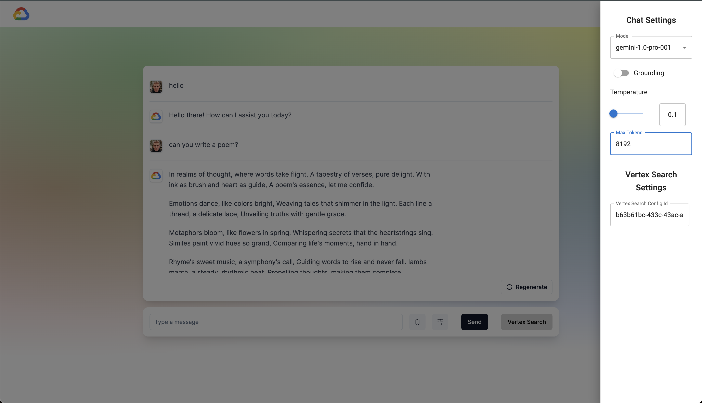

```
██████╗ ██████╗ ██████╗ ██████╗
██╔══██╗╚════██╗██╔══██╗╚════██╗
██████╔╝ █████╔╝██║  ██║ █████╔╝
██╔══██╗██╔═══╝ ██║  ██║██╔═══╝
██║  ██║███████╗██████╔╝███████╗
╚═╝  ╚═╝╚══════╝╚═════╝ ╚══════╝
```



## Disclaimer

This is a personal project. It has been developed for learning purposes and published in a public repository for inspiration to the broad community. Support will not be given on this code, and this code is not intended to be used in production.

## Getting Started

This guide will cover first how to use this repo in **local development**, and then how to deploy it into **GCP Cloud Run**. It considers a fresh project. It assumes as well you have cloned the code into your local environment. If you have no code skills, skip the local development and go straight into GCP Cloud Run.
Some steps are overlapped in both approaches, please feel free to skip them if you have already completed them.

# Local development:

## 1. Pre-configuration script

Clone the repo and run the following script, changing the value for the `PROJECT_ID`:

```bash
# Set your project ID
PROJECT_ID="your-project-id"
PROJECT_NUMBER=$(gcloud projects describe $PROJECT_ID --format='value(projectNumber)')
USER_EMAIL= "your-local-user-email"

#Enable the cloud build API
gcloud services enable cloudbuild.googleapis.com --project=$PROJECT_ID
#Enable cloud run API
gcloud services enable run.googleapis.com --project=$PROJECT_ID
#Enable secret manager API
gcloud services enable secretmanager.googleapis.com --project=$PROJECT_ID
#Enable Vertex AI API
gcloud services enable aiplatform.googleapis.com --project=$PROJECT_ID

gcloud projects add-iam-policy-binding $PROJECT_ID \
  --member=$USER_EMAIL \
  --role="roles/iam.serviceAccountTokenCreator"
```

## 2. OAuth Config

The first step is going to be to create the Application Credentials in the Google Cloud Console.

- Go to `Oauth Consent Screen` to start configure it
- For `User Type` select `External` and click `Create`
- Fill app name and support email
- For Authorized Domains, you will need to have your cloud run deployed to add the right domain.
- Add Developer contact information
- Clic `Save and Continue`
- Clic `ADD OR REMOVE SCOPES`
- Select all.
- Clic `Update` and clic `Save and Continue`
- Add test users (at least the account you will use) and clic `Save and Continue`
- Click `BACK TO DASHBOARD`
- Now you need to get a client id and client secret, to connect to Google Cloud services through the app.
- Clic `Credentials` then `Create Credentials` then `OAuth client ID`
- For `Application Type` select `Web Application` and give it a name
- For `Authorized JavaScript origins` you don't need to add anything.
- For `Authorized redirect URIs` add `http://localhost:3000/api/auth/callback/google`.
- Clic `Create`
- Click on `DOWNLOAD JSON`

## 3. Create local .env files

Now it is time to create the local files for both the frontend and the backend, with the necessary environment variables. Among those variables, we'll find the credentials.

### 3.1. ENV file for frontend

- In the code, go to `frontend`
- Create a file named `.env.local`
- Inside the file, you'll need to paste the following text, modifying the values accordingly. For the client_id and the client_secret, you'll find the values in the JSON you just downloaded.

```bash
AUTH_SECRET = "your-auth-secret" #To get one, run: openssl rand -base64 32

PROJECT_ID = "your-project-id"

NEXT_PUBLIC_ENV = "dev"

GOOGLE_CLIENT = '{
    "web":
        {
            "client_id": "your-client-id",
            "client_secret": "your-client-secret"
        }
    }'
```

### 3.1. ENV file for backend

This is not needed so far.

## 4. Run the local servers

Now, run the development server:

- Open a new terminal and run:

```bash
cd frontend
npm ci #Perform a clean install of the dependencies
npm run dev
```

- Open another terminal in parallel, and run:

```bash
cd backend
pip install -r requirements.txt #Install all the python requirements
python3 main.py
```

Open [http://localhost:3000](http://localhost:3000) with your browser to see the result.
ENJOY!!

# Deployment to Cloud RUN for a fresh project

## 0. Modify the organization policy `allowedPolicyMemberDomains`

- In the console, go to `Organization Policies`
- In the search bar, type `allowedPolicyMemberDomains`
- Click on `Domain restricted sharing`
- Click on `MANAGE POLICY`
- Change to `Google-managed default`
- Click on `SET POLICY`

## 1. Pre-configuration script

Clone the repo and run the following script, changing the value for the `PROJECT_ID`:

```bash
# Set your project ID
PROJECT_ID="your-project-id"
PROJECT_NUMBER=$(gcloud projects describe $PROJECT_ID --format='value(projectNumber)')

#Enable cloud run API
gcloud services enable run.googleapis.com --project=$PROJECT_ID
#Enable secret manager API
gcloud services enable secretmanager.googleapis.com --project=$PROJECT_ID
#Enable Vertex AI API
gcloud services enable aiplatform.googleapis.com --project=$PROJECT_ID


#Give the gcloud build service account the necessary roles
CLOUDBUILD_SERVICE_ACCOUNT_EMAIL="${PROJECT_NUMBER}@cloudbuild.gserviceaccount.com"
gcloud projects add-iam-policy-binding $PROJECT_ID \
  --member="serviceAccount:${CLOUDBUILD_SERVICE_ACCOUNT_EMAIL}" \
  --role="roles/run.admin"

gcloud projects add-iam-policy-binding $PROJECT_ID \
  --member="serviceAccount:${CLOUDBUILD_SERVICE_ACCOUNT_EMAIL}" \
  --role="roles/artifactregistry.admin"

gcloud iam service-accounts add-iam-policy-binding \
  --project=$PROJECT_ID \
  ${PROJECT_NUMBER}-compute@developer.gserviceaccount.com \
  --member="serviceAccount:${CLOUDBUILD_SERVICE_ACCOUNT_EMAIL}" \
  --role="roles/iam.serviceAccountUser"

COMPUTE_SERVICE_ACCOUNT_EMAIL="${PROJECT_NUMBER}-compute@developer.gserviceaccount.com"
gcloud projects add-iam-policy-binding $PROJECT_ID \
  --member="serviceAccount:${COMPUTE_SERVICE_ACCOUNT_EMAIL}" \
  --role="roles/secretmanager.secretAccessor"

```

## 2. OAuth Config

The first step is going to be to create the Application Credentials in the Google Cloud Console. If you have already done this for local development and you have downloaded the JSON, you can go to step 3.

- Go to `Oauth Consent Screen` to start configure it
- For `User Type` select `External` and click `Create`
- Fill app name and support email
- For Authorized Domains, you will need to have your cloud run deployed to add the right domain.
- Add Developer contact information
- Clic `Save and Continue`
- Clic `ADD OR REMOVE SCOPES`
- Select all.
- Clic `Update` and clic `Save and Continue`
- Add test users (at least the account you will use) and clic `Save and Continue`
- Click `BACK TO DASHBOARD`
- Now you need to get a client id and client secret, to connect to Google Cloud services through the app. We'll then store those in secret manager.
- Clic `Credentials` then `Create Credentials` then `OAuth client ID`
- For `Application Type` select `Web Application` and give it a name
- For `Authorized JavaScript origins` you don't need to add anything.
- For `Authorized redirect URIs` you don't need to add anything now.
- Clic `Create`
- Download the JSON for the client secret and store it in `Secret Manager`

## 3. Storing the secrets in `Secret Manager`

- Open `Secret Manager` in your console

### 3.1. google-client-secret

This will be the secret used for the application to authenticate.

- Clic `Create Secret`
- Name it `google-client-secret`
- For `Secret value` select `Upload File` and upload the json
- Customize the rest if needed and clic `Create`

### 3.1. AUTH_SECRET

This secret will be used by nextJS to encrypt the cookie containing the credentials.

- Clic `Create Secret`
- Name it `AUTH_SECRET`
- For `Secret value`:
  - If you generated a value when doing local development (see 3.1. for local development), paste here the value.
  - Otherwise, in your terminal, run the command `openssl rand -base64 32` and paste this value.

## 4. Deploying to Cloud Run

Now we are going to build and deploy both the backend and the frontend to cloud run. Use the following command:

```bash
gcloud builds submit --project="your-project-id" --substitutions=BRANCH_NAME="your-branch",REPO_NAME="your-repo",_ENV=prod --config=cloudbuild/cloudbuild.yaml --region=europe-west1 .
```

It will take around 20 minutes to deploy. If you find errors here, ping `@jmugicag`
DON'T FORGET TO COME BACK HERE FOR THE LAST STEP :)

## 5. Setting the redirect URI in credentials

Once the service is deployed, we need to set the redirect URI for the Application Credentials, so the authentication will work.

- In Cloud Run, open the frontend service and copy the URL
- Go to `Credentials` and select the `OAuth 2.0 Client IDs` that you have created
- For `Authorized redirect URIs` add `https://your-cloud-run-url/api/auth/callback/google`.

Now, open the cloud run frontend service, and enjoy!
